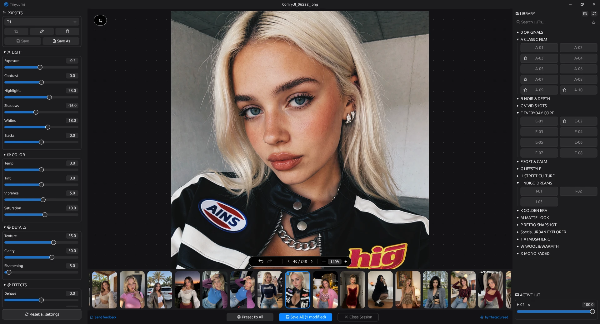

<div align="center">

# TinyLuma

**Lightweight, native post-processor and batch editor for AI-generated images.**  
Enhance Stable Diffusion, Midjourney, Flux, and ComfyUI generations in seconds.

[](LICENSE)
[](https://www.rust-lang.org/)
[](#)
[](#)

[Features](#key-features) • [Why TinyLuma?](#why-tinyluma) • [AI Detail Engine](#engineered-for-ai-generations) • [Metadata Preservation](#comfyui--ai-metadata-preservation-optional) • [Download](#download--quick-start)



</div>

## Overview

**TinyLuma** is a fast, standalone desktop photo editor designed specifically for finishing AI-generated artwork and photo sets. Instead of waiting for heavy creative suites (Lightroom, Photoshop) to launch, TinyLuma provides a focused, bloat-free workflow with professional Oklab color science, custom-tuned detail recovery, `.cube` LUT support, and instant batch processing.

No Electron, no web runtime, no subscriptions — a single native executable under **8 MB**.

## Key Features

- **⚡ Blazing Fast & Ultra-Lightweight (~8 MB):** Built with pure Rust and `egui`. Starts instantly, uses minimal RAM, and renders edits at 60 FPS via multi-threaded Rayon pipelines and 3D LUT caching.
- **🧠 Custom AI Detail Engine:** Proprietary algorithms for `Texture`, `Clarity`, and `Sharpen` tuned specifically to eliminate smooth AI "plastic skin" and restore micro-contrast without edge halos.
- **🧬 ComfyUI & A1111 Metadata Preservation:** Exported PNGs retain raw prompt and node graph metadata (`tEXt`, `zTXt`, `iTXt` chunks). Your ComfyUI workflow stays intact.
- **🎨 Oklab Perceptual Color Grading:** 16 non-destructive controls (Light, Color, Details, Effects) powered by Oklab color space and Bradford chromatic adaptation to avoid color shifts and clipping.
- **🎞️ Batch Workflow & Filmstrip:** Navigate multi-image sessions, use **Preset to All** to sync looks across an entire generation batch, and export with background threading.
- **🎭 Complete 3D LUT System:** Direct `.cube` LUT library integration with subfolder categorization, search, favorites (★), and intensity blending (0–100%).
- **⚖️ Before / After Split Screen:** Interactive draggable split divider to compare edits, instantly toggled with the `\` key.

## Why TinyLuma?

| Feature | Standard Editors (Lightroom / PS) | TinyLuma |
| :--- | :--- | :--- |
| **Startup Time** | 5–15 seconds | **Instant (<0.3s)** |
| **Executable Size** | Gigabytes | **~8 MB** |
| **ComfyUI/A1111 Metadata** | Stripped by default | **Preserved (Full pass-through)** |
| **AI Texture Handling** | Generic sharpening (causes ringing) | **Tuned for synthetic & AI surfaces** |
| **LUT Workflow** | Buried in submenus | **Instant visual library & blending** |
| **Memory Footprint** | Heavy (>1 GB idle) | **Strictly bounded LRU cache** |

## Engineered for AI Generations

Raw AI images (Stable Diffusion, Midjourney, Flux) often suffer from common artifacts: flat lighting, low local contrast, and unnatural "plastic" skin textures. TinyLuma solves this at the algorithm level:

- **Clarity:** Logarithmic local contrast base with soft-knee limiting. Enhances depth and scene separation without burning highlights or creating dark halos around subjects.
- **Texture:** Edge-preserving bilateral separation. Extracts fine surface details (hair strands, fabric weave, skin pores) without amplifying noise or digital artifacts.
- **Sharpen:** Asymmetric luma unsharp mask. Limits light-edge blooming (≤ 0.20) and dark ringing (≤ 0.12) to produce crisp, print-ready results.
- **Film Grain:** Darktable-inspired 3-octave simplex noise mapped via paper-response curves, strongest in midtones to naturally break up AI surface banding.

*All spatial radii scale dynamically to exported resolution, ensuring identical results between preview and full-res renders.*

## ComfyUI & AI Metadata Preservation (Optional)

Most editors silently wipe workflow metadata, while others force-embed it. TinyLuma gives you **full privacy control with a simple toggle**:

- **Keep Workflows (Opt-In):** Copies `tEXt`, `zTXt`, `iTXt`, and `eXIf` data from source to export. Drop your edited PNG straight back into ComfyUI or Automatic1111 to reload your exact prompt, seed, and node graph.
- **Protect Your Privacy (Opt-Out):** Uncheck the metadata box to export completely clean images — no leaked prompts, models, LoRAs, or generation settings.

## Keyboard Shortcuts

| Key | Action |
| :--- | :--- |
| `\` | Toggle Before / After split screen |
| `←` / `→` | Previous / Next image in session |
| `Ctrl + Z` / `Ctrl + Y` | Undo / Redo (drag coalesced) |
| `Ctrl + +` / `Ctrl + -` | Zoom In / Out |
| `Ctrl + 0` | Fit to Viewport |
| `Delete` / `Backspace` | Remove frame from session |
| `Space + Drag` | Pan canvas |

## Download & Quick Start

### Pre-built Binaries
Download the latest standalone executable from the Releases tab. No installation required.

### Build from Source
Ensure you have Rust 1.95+ installed:

```bash
git clone https://github.com/ThetaCursed/TinyLuma.git
cd TinyLuma
cargo build --release
```

The optimized binary will be compiled to `target/release/TinyLuma.exe`.

## Folder Structure

Place your custom `.cube` 3D LUTs inside the `luts/` directory. Subfolders will automatically turn into categories inside the UI:

```text
TinyLuma/
├── tiny_luma.exe
├── config/             # Automatically created (presets & favorites)
└── luts/               # Put your .cube files here
    ├── Film/
    │   └── Kodak_Portra.cube
    └── Cinematic/
        └── Moody_Teal.cube
```

## Supported Formats

- **Exports:** 
  - **PNG** (Lossless, with optional metadata preservation)
  - **JPEG** (Lossy, configurable quality 1–100, default 90)
  - **WebP** (Lossy, configurable quality 1–100, optimized for web/social sharing)


## License

TinyLuma is open-source software licensed under the **GNU Affero General Public License v3.0 or later (AGPL-3.0-or-later)**. See the [LICENSE](LICENSE) file for details.

Copyright (c) 2026 ThetaCursed.